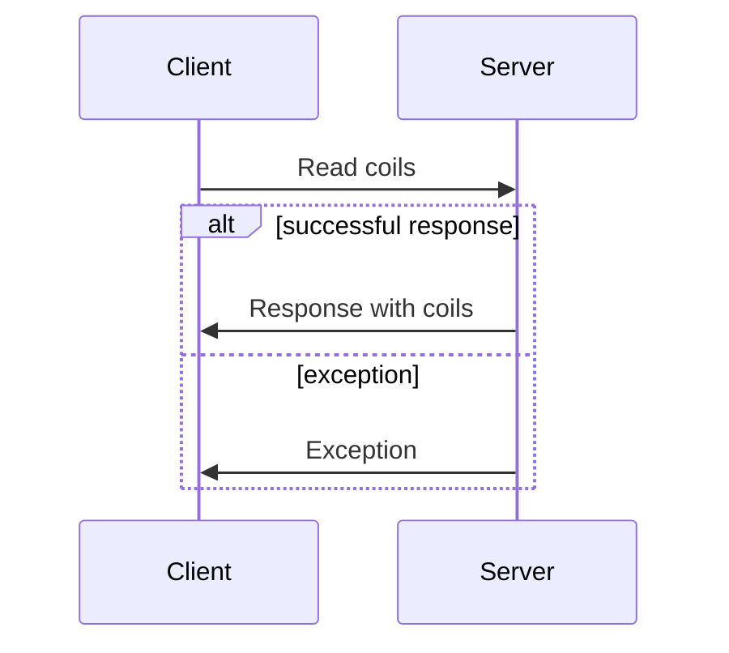

import useBaseUrl from '@docusaurus/useBaseUrl';

Modbus is a ubiquitous communication protocol used to communicate with various industrial devices, most notably PLCs. Its simplicity and versatility make
it popular in numerous applications. The standard itself is freely available from the [Modbus Organization](https://modbus.org/). It supports both TCP/IP
and serial communication, and more recently, has been defined for secure operation over TLS. Modbus is sometimes referred to as "Modicon Modbus" or just
"Modicon" for historical reasons.

Modbus is a simple request-response protocol, and the server component is completely stateless. A client issues a request to the server, then the server
performs the action and returns the matching response or an exception code. Clients and servers are referred to as "masters" and "slaves" in the specification
and older documents, however, we avoid this terminology in our documentation.

## Data model

The Modbus data model consists of four point types described in the following table:

| Point type name  | Type        | R/W        |
| ---------------- | ----------- | ---------- |
| Coil             | Single bit  | read/write |
| Discrete input   | Single bit  | read-only  |
| Holding register | 16-bit word | read/write |
| Input register   | 16-bit word | read-only  |

Each object type is addressed with a 16-bit index. The indices are not shared between the types.
In other words, a Modbus device may provide up to 65,536 points of each type.

:::tip
On the wire, all types are addressed with indices from 0 to 65535. However, you will frequently encounter a convention in product documentation where addresses
are prefixed with an *entity type* identifier and begin addressing from 1 instead of zero:

* Coils might be identified as running from **0**0001 to **0**9999
* Discrete inputs might be identified as running from **1**0001 to **1**9999
* Input registers might be identified as running from **3**0001 to **3**9999
* Holding registers might be identified as running from **4**0001 to **4**9999

This convention is often confusing and purely artificial. This library only uses the raw 16-bit addressing. To convert the entity convention above to raw indices,
remove the leading entity type and subtract 1.
:::

### Point interpretation

Because Modbus has limited point types, applications often extend the data model to represent more complex values. You will need to read device
documentation to interpret the data appropriately. For example, applications often use multiple registers to represent a single physical value.

Here are some examples of common point interpretations:

- Interpreting the first bit of a register as a sign bit making the range -32,768 to 32,767 instead of 0 to 65,535
- Using different bits within one or more registers to represent distinct states (aka bitfields)
- Using two registers to represent a 32-bit value
- Using four registers to represent a 64-bit value
- Using two registers to represent single precision IEEE-754 floating point value
- Using four registers to represent a double precision IEEE-754 floating point value
- Using a coil or holding register as a heartbeat that the client must periodically write to maintain a certain state

The endianness of how compound values are laid out in registers may also vary from device to device.

## Function codes

The following table lists the functions currently supported by our library:

| Code | Description                   | Support |
| ---- | ----------------------------- | ------- |
| 0x01 | Read coils                    | ✔️    |
| 0x02 | Read discrete inputs          | ✔️    |
| 0x03 | Read holding registers        | ✔️    |
| 0x04 | Read input registers          | ✔️    |
| 0x05 | Write single coil             | ✔️    |
| 0x06 | Write single register         | ✔️    |
| 0x15 | Write multiple coils          | ✔️    |
| 0x16 | Write multiple registers      | ✔️    |

These functions are all that is required for the vast majority of applications using Modbus. Additional function codes can be added upon request.

Modbus also allows user-defined function codes in the range 65 to 72 and 100 to 110. This library does not currently support user-defined functions,
but support can be added upon request.

## Exceptions

Modbus servers return an exception code when the request cannot be fulfilled. Here's the complete list of possible exceptions:

| Code | Name                                    | Description                                                                     |
| ---- | --------------------------------------- | ------------------------------------------------------------------------------- |
| 0x01 | ILLEGAL FUNCTION                        | Function code is not allowed or supported                                       |
| 0x02 | ILLEGAL DATA ADDRESS                    | A data address is not allowed                                                   |
| 0x03 | ILLEGAL DATA VALUE                      | A value contained in the request is not an allowed                              |
| 0x04 | SERVER DEVICE FAILURE                   | An unrecoverable error occurred when trying to perform the action               |
| 0x05 | ACKNOWLEDGE                             | Specialized use in conjunction with programming commands (unsupported)          |
| 0x06 | SERVER DEVICE BUSY                      | Specialized use in conjunction with programming commands (unsupported)          |
| 0x08 | MEMORY PARITY ERROR                     | Used with function code 20 and 21 (unsupported)                                 |
| 0x0A | GATEWAY PATH UNAVAILABLE                | Gateway was unable to establish a path to the target device (only for gateways) |
| 0x0B | GATEWAY TARGET DEVICE FAILED TO RESPOND | Gateway did not receive a response from the target device (only for gateways)   |
