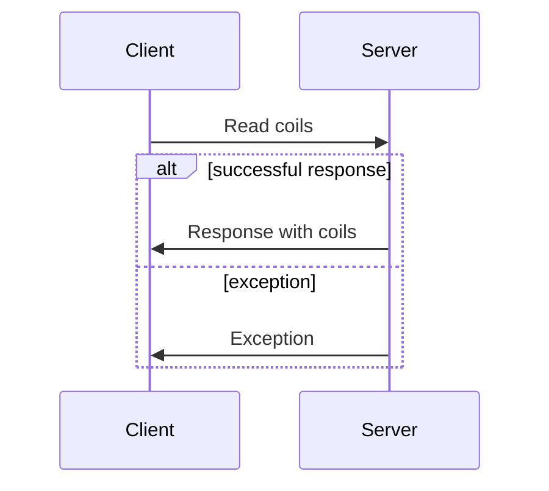

import useBaseUrl from '@docusaurus/useBaseUrl';

Modbus is an established communication protocol used to communicating with various industrial electronic devices, notably PLCs. Its simplicity and versatility makes it very popular 
in numerous applications. It is openly published and royalty-free by the [Modbus Organization](https://modbus.org/). It supports both TCP/IP and serial communication.
Modbus is sometimes referred to as "Modicon Modbus" or just "Modicon" for historical reasons.

Modbus is a simple request-response protocol, meaning there is no complex internal state machines or buffers. This simplicity however sometimes means that the application has more
responsibilities than stateful protocols such as DNP3 (IEEE-1815). A client issues a request to the server, then the server performs the action and returns a response or an exception code.
Clients and servers are sometimes known as "masters" and "slaves" in older documents.

## Data model

The Modbus data model consists of four point types described in the following table:

| Point type name  | Type        | R/W        |
| ---------------- | ----------- | ---------- |
| Coil             | Single bit  | Read-write |
| Discrete input   | Single bit  | Read-only  |
| Holding register | 16-bit word | Read-write |
| Input register   | 16-bit word | Read-only  |

Each object type is addressed with a 16-bit index. The indices are not shared between the types.
In other words, your application can have up to 65,536 points of each type for a total of 262,144 points.

### Point interpretation

Due to its limited point types, the Modbus data model is often extended to represent more complex values. You will need to thoroughly read the device documentation
to interpret the data appropriately. For example, applications often use multiple points to represent a single data.

Here are some examples of common point interpretations:

- Considering the first bit of a register as a sign bit making the range -32,768 to 32,767 instead of 0 to 65,535
- Using two register to represent a 32-bit value
- Using four registers to represent a 64-bit value
- Using two registers to represent single precision IEEE-754 floating point value
- Using four registers to represent a double precision IEEE-754 floating point value
- Using one or more register to represent a bitmask
- Using a coil as an heartbeat where the user needs to periodically flip it to advertise that the device is still running

## Function codes

The following table illustrates the Modbus public function code and their support status in our library:

| Code | Description                   | Support |
| ---- | ----------------------------- | ------- |
| 0x01 | Read coils                    | **Yes** |
| 0x02 | Read discrete inputs          | **Yes** |
| 0x03 | Read holding registers        | **Yes** |
| 0x04 | Read input registers          | **Yes** |
| 0x05 | Write single coil             | **Yes** |
| 0x06 | Write single register         | **Yes** |
| 0x07 | Read exception status         | No      |
| 0x08 | Diagnostic                    | No      |
| 0x11 | Get com event counter         | No      |
| 0x12 | Get com event log             | No      |
| 0x15 | Write multiple coils          | **Yes** |
| 0x16 | Write multiple registers      | **Yes** |
| 0x17 | Report server ID              | No      |
| 0x20 | Read file record              | No      |
| 0x21 | Write file record             | No      |
| 0x22 | Mask write register           | No      |
| 0x23 | Read/write multiple registers | No      |
| 0x24 | Read FIFO queue               | No      |
| 0x43 | Read device ID                | No      |

Modbus also user-defined function codes in the ranges 65 to 72 and 100 to 110. However, our library
does not support those.

## Exceptions

Modbus servers can return exception code when the request cannot be fulfilled. Here's the complete list:

| Code | Name                                    | Description                                                                     |
| ---- | --------------------------------------- | ------------------------------------------------------------------------------- |
| 0x01 | ILLEGAL FUNCTION                        | Function code is not allowed or supported                                       |
| 0x02 | ILLEGAL DATA ADDRESS                    | A data address is not allowed                                                   |
| 0x03 | ILLEGAL DATA VALUE                      | A value contained in the request is not an allowed                              |
| 0x04 | SERVER DEVICE FAILURE                   | An unrecoverable error occured when trying to perform the action                |
| 0x05 | ACKNOWLEDGE                             | Specialized use in conjunction with programming commands (unsupported)          |
| 0x06 | SERVER DEVICE BUSY                      | Specialized use in conjunction with programming commands (unsupported)          |
| 0x08 | MEMORY PARITY ERROR                     | Used with function code 20 and 21 (unsupported)                                 |
| 0x0A | GATEWAY PATH UNAVAILABLE                | Gateway was unable to establish a path to the target device (only for gateways) |
| 0x0B | GATEWAY TARGET DEVICE FAILED TO RESPOND | Gateway did not receive a response from the target device (only for gateways)   |
