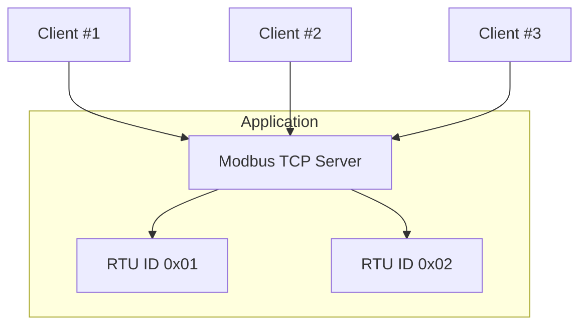

import Tabs from '@theme/Tabs';
import TabItem from '@theme/TabItem';

## DeviceMap

Each TCP server can serve requests that targets multiple devices with different unit IDs. This is notably used in
gateway products where each request is forwarded to downstream devices.

The device map represents this mapping. It associates an 8-bit unit ID with a write handler and a unique database.



## Creating a server

To create a server, first build a `DeviceMap` for each unit ID that the server will answer. Then use the `create_tcp_server` static method of the `Server` class.
The created server will start listening on the port immediately.

The parameters of `create_tcp_server` are the following:

- `runtime`: tokio runtime used to drive the async process. See [Runtime](../runtime.mdx) for more details.
- `endpoint`: endpoint specified in the format `<address>:<port>`. Addresses may be any specified as any valid IPv4 or IPv6 local endpoint, such as:
    - `127.0.0.1` for localhost only
    - `0.0.0.0` for all adapters
    - The IP address for a particular adapter
- `max_sessions`: maximum sessions that are kept alive by the server. When the maximum number of sessions is reached, a new connection will end the oldest session
  in order to limit resource usage.

<Tabs
groupId="language"
defaultValue="Rust"
values={[
{label: 'Rust', value: 'Rust'},
{label: 'C', value: 'C'},
{label: 'Java', value: 'Java'},
{label: 'C#', value: 'C#'},
]}>
<TabItem value="Rust">

```rust
{{#include ../rodbus/examples/server.rs:tcp_server_create}}
```

</TabItem>
<TabItem value="C">

```c
{{#include ../ffi/bindings/c/server_example.c:device_map_init}}

{{#include ../ffi/bindings/c/server_example.c:tcp_server_create}}
// check error
```

</TabItem>
<TabItem value="Java">

```java
{{#include ../ffi/bindings/java/examples/src/main/java/io/stepfunc/rodbus/examples/ServerExample.java:device_map_init}}

{{#include ../ffi/bindings/java/examples/src/main/java/io/stepfunc/rodbus/examples/ServerExample.java:tcp_server_create}}
```

</TabItem>
<TabItem value="C#">

```csharp
{{#include ../ffi/bindings/dotnet/examples/server/Program.cs:device_map_init}}

{{#include ../ffi/bindings/dotnet/examples/server/Program.cs:tcp_server_create}}
```

</TabItem>
</Tabs>

:::tip
In Rust, you can easily wrap your `RequestHandler` implementation in a `Arc<Mutex>` using the `wrap()` default implementation.
:::
