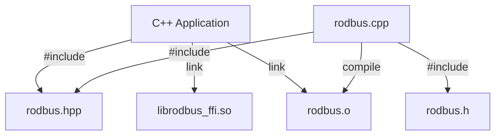

import useBaseUrl from '@docusaurus/useBaseUrl';
import sitedata from '../../sitedata.json'

Each [C package distribution](./c_lang.mdx) also includes a C++ API that fully wraps the C API. The `rodbus.hpp` file includes the public API
and a `src/rodbus.cpp` contains the companion code which maps the C++ API to the underlying C API.



## CMake Usage

The CMake package script includes a `rodbus_cpp` target that automatically links with the C bindings and builds the C++ wrapper code.

Make the find package script discoverable by adding it to the prefix path. Next, call `find_package`:

```cmake
# Define CMake project with CXX language
project(my_awesome_project LANGUAGES C CXX)

# Import the rodbus package
set(CMAKE_PREFIX_PATH ${DISTRIBUTION_PATH}/cmake)
# Tell cmake which library we're linking
set(RODBUS_RUST_TARGET x86_64-unknown-linux-gnu)
find_package(rodbus REQUIRED)

# Create and link the executable w/ the c++ library
add_executable(my_awesome_project main.cpp)
target_link_libraries(my_awesome_project PRIVATE rodbus_cpp)
```

:::note
The `rodbus_cpp` CMake target is made available only if the `CXX` language is enabled. Languages can be enabled in the
[project()](https://cmake.org/cmake/help/latest/command/project.html) command or with a separate
[enable_language()](https://cmake.org/cmake/help/latest/command/enable_language.html) command.
:::

:::tip
Just like with the C library, it's easy compile and link a program from the command line without CMake:

```
> g++ main.cpp c-bindings/src/rodbus.cpp -I ./c-bindings/include/ -lrodbus_ffi
```

All you have to do is compile and link one additional file!
:::

## Mapping

Most of the abstract concepts in the binding generator map directly to C++.

### Errors

The code generator transforms all C API errors into C++ exceptions containing the error enum. All exceptions derive from `std::logic_error`.

Additional validations, such as detecting use-after-move, throw `std::logic_error`.

:::warning
Uncaught callback exceptions terminate the program. Always wrap callback logic with `try/catch` syntax to prevent uncaught exceptions.
:::

### Iterators

Iterators are wrapped in a class for easier manipulation. Iterating on them should done like so:

```cpp
while(iter.next()) {
    auto value = iter.get();
}
```

The `next()` method advances the iterator and returns `true` if a value exists. The `get()` method returns the current value, or throws
`std::logic_error` if the end was reached.

:::warning
The iterator wrapper does **not** copy and accumulate values like in C# or Java. Never use an iterator outside its callback. The iterator typically references stack memory, causing undefined behavior if used after callback completion.
:::

### Collections

Collections pass by constant reference to `std::vector`. Elements are copied internally.

### Classes

Classes have an opaque pointer inside and therefore cannot be copied. They can be moved around with `std::move`. If a method
is called on a moved class it throws a `std::logic_error`.

The class destructor will call the underlying C destructor automatically.

### Interfaces

Interfaces are abstract classes containing only pure virtual functions where every callback must be implemented. The destructor is virtual to allow proper cleanup.

Owned interfaces that are invoked asynchronously by the library are passed into the API as a `std::unique_ptr<T>`. Use `std::make_unique` to create these smart pointers.

Non-owned (synchronous) interfaces are passed by reference. There are also functional wrappers that take a lambda
function as an argument available in the `dnp3::functional` namespace.

### Async methods

The C++ standard library lacks comprehensive asynchronous computation support. You can only extract a value from `std::future` using the blocking `get` method, with no way to chain futures asynchronously.

Asynchronous methods are mapped to callback interfaces with two methods:

* `on_complete` is called when the operation succeeds
* `on_failure` is called if an error occurs

If you already use an external futures library, it will be easy to use our callbacks to complete your futures.